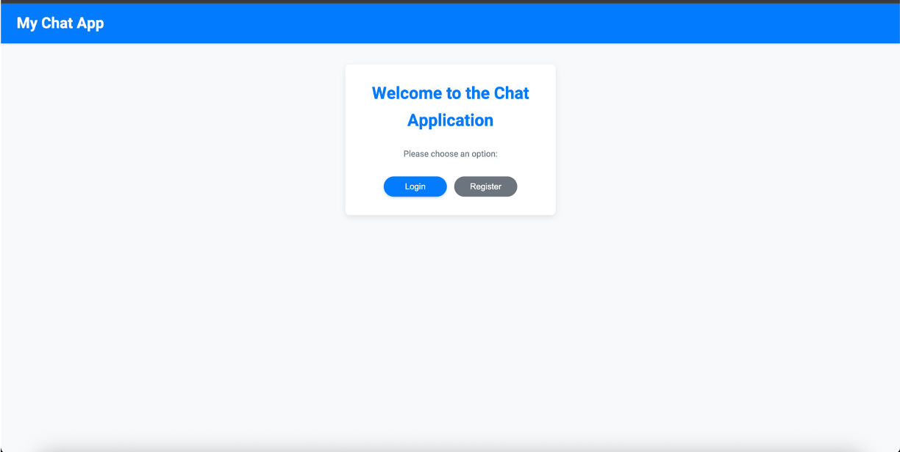
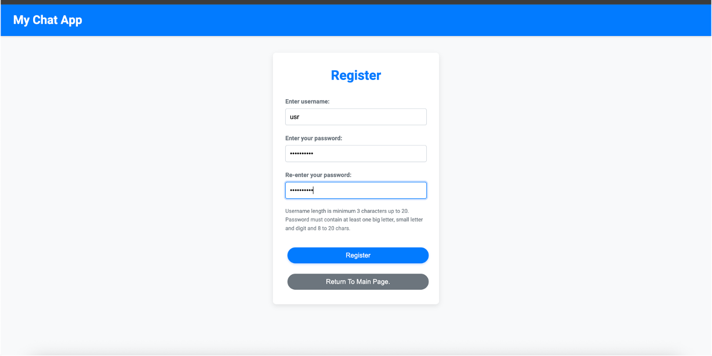
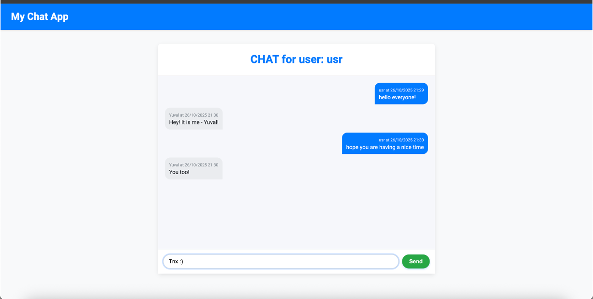

# REAL-TIME CHAT APPLICATION

A simple, real-time chat application built using Flask and Flask-SocketIO for instant, bidirectional communication via WebSockets.

## Demo Screens

  
Show/Hide Demo

  ### Application Start
  

  ### Registration / Setup Screen
  

  ### Chatting
  

---

## FEATURES

* User Authentication: Secure login and registration.
* Real-Time Messaging: Instant message delivery to all connected users using WebSockets.
* Persistent Storage: Messages are loaded from the database upon joining the chat.
* Modern UI: Clean and modern look, applied via main.css and chat.css.

---

## INSTALLATION AND SETUP

1. PREREQUISITES

Ensure you have Python 3.x and pip installed.

2. INSTALL PYTHON DEPENDENCIES

The core application requires Flask and Flask-SocketIO.
pip install Flask Flask-SocketIO

## RUNNING THE APPLICATION (DEVELOPMENT)

Run the application using the standard Python command. This utilizes the Flask development server wrapped by Flask-SocketIO.

python flask_app.py

The application will start on the host and port defined in your url.js file:
Open in browser: http://127.0.0.1:12345

---

## CRITICAL NOTES FOR PRODUCTION DEPLOYMENT

### Configuration and Persistence in the Chat Application
The file url.js serves as the central configuration hub for network connectivity within the client-side JavaScript code. 
It defines the crucial addresses (IP and port) the application will use to establish the WebSocket connection, which is fundamental for real-time chat functionality provided by SocketIO. 
Currently, it is set to use a local development configuration: "ip": "0.0.0.0", "port": "12345", and "url": "127.0.0.1:12345".
These settings instruct the client to connect back to the local development server, but they must be updated to the server's public domain address when deploying to production. 
Regarding data handling, the application utilizes a mechanism, managed primarily within models.py and invoked by flask_app.py, 
where the underlying database structure is created from scratch during the very first run of the application. 
Once initialized, the database persists the user and message records, ensuring that all user accounts and 
chat history are saved to the disk and remain available even if the server is stopped and restarted.
